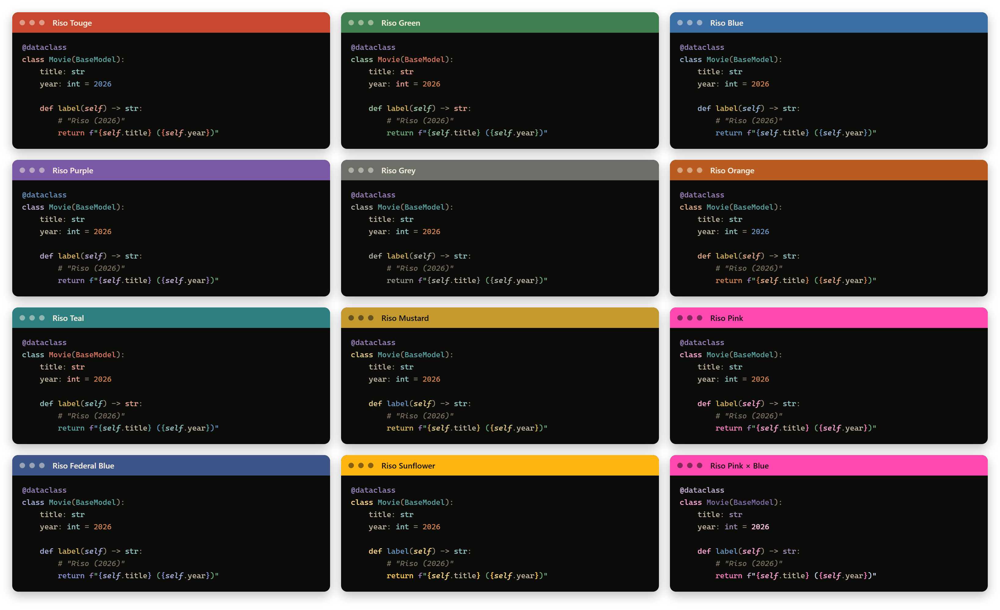
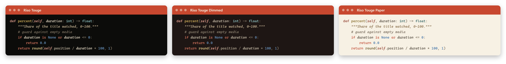
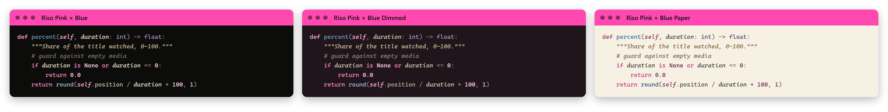
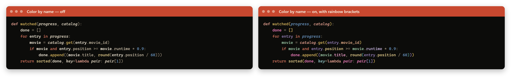

# Riso Themes

VS Code themes printed like a risograph: an ink on paper, a second ink, and
nothing more. Eleven inks and a two-ink duotone, each on three papers — near
black, dimmed and light — for 36 themes. Every text color is checked for
contrast on every paper.

## Install

Search **Riso Themes** in the Extensions view, or:

    code --install-extension lucascristovam.riso-themes

Then pick one with **Preferences: Color Theme** (`Ctrl+K Ctrl+T`), or open
**Riso: Options…** from the Command Palette.

## The inks

| Theme | Ink | |
|---|---|---|
| **Riso Touge** | `#C8482F` | brick vermilion, the family's first ink |
| **Riso Pink** | `#FF48B0` | fluorescent pink, the risograph's signature |
| **Riso Orange** | `#B85C22` | burnt orange / terracotta |
| **Riso Sunflower** | `#FFB511` | warm, vivid yellow |
| **Riso Mustard** | `#C49A2F` | printed mustard |
| **Riso Green** | `#3E8050` | forest green |
| **Riso Teal** | `#2E7F80` | printed teal |
| **Riso Blue** | `#3A6EA5` | printed cobalt |
| **Riso Federal Blue** | `#3D5588` | deep navy-indigo |
| **Riso Purple** | `#7A5AA6` | plum violet |
| **Riso Grey** | `#6B6F68` | graphite, like old newsprint |
| **Riso Pink × Blue** | pink + blue | duotone: two inks and their overprint |

How the colors are laid out:

- **The theme's ink** marks what you act on: keywords, the cursor, the active
  tab, badges, buttons, and the status bar — a solid band of ink, like a
  poster's title.
- **The other inks of the family** print the code: functions, types, strings,
  numbers and decorators each get one. When a role would repeat the theme's own
  ink (or one too close to it), it falls through to a spare ink.
- **Declarations and built-ins** use their role's ink at a second weight, so
  `def` / `const` read apart from `if` / `return`, and `print` / `str` apart
  from your own functions and classes — without adding more hues.
- **Docstrings and JSDoc** print in the second ink, in italic, apart from code
  strings.

## Three papers

- **Normal** — near-black stock (`#0C0C0A`).
- **Dimmed** — lifted a notch (around `#191713`) with softer text, for less
  contrast. Each dimmed paper is tinted with its own ink at the same luminance,
  so no theme is lighter than another.
- **Paper** — light: ink on warm cream (`#F7F1E4`), the stock a riso actually
  prints on, with a sepia second ink.

Switch with *Background* in **Riso: Options…**; **Riso: Toggle Dimmed
Background** flips normal ↔ dimmed.

## The duotone

**Riso Pink × Blue** is printed with two inks only, like the classic riso
two-drum print: pink for keywords, blue for functions and strings, and the
purple where they overprint — computed by multiplying the two inks, as the
paper would — for types and decorators.

## Color by name

Every parameter, local variable, attribute, constant and class gets its own
color, derived from its name: `entry` is the same color on every line and in
every file, like JetBrains' semantic highlighting. Globals, imports and
built-ins keep the theme's color, so the rainbow stays on what you are reading.
Each paper has its own set of 16 colors.

It is off by default: turn it on with **Riso: Toggle Rainbow Identifiers**, or
*Color by name* in **Riso: Options…**, where *Colored by name* chooses what gets
a color.

It reads the language's semantic tokens, so it works wherever the language
extension provides them:

| Language | Needs |
|---|---|
| TypeScript, JavaScript | built in |
| Python | Pylance (installed with the Python extension) |
| Java, C#, C/C++, Rust, Dart | their language extension (Red Hat Java, C# Dev Kit, C/C++ or clangd, rust-analyzer, Dart) |
| Go | the Go extension, with `"gopls": { "ui.semanticTokens": true }` |

Anywhere else the theme looks the same, just without it.

## Brackets and indent guides

Brackets take one color per nesting level (VS Code's native bracket pair
colorization, no extra extension), in one of three modes:

- **Rainbow** (default) — the theme's syntax inks, ordered so neighbouring
  levels never share a hue.
- **Duotone** — the print's two inks, alternating.
- **Plain** — every level in the punctuation tone.

Indent guides can follow the same modes (plain by default). *Bracket pair
guides* in the options menu turns on VS Code's lines joining each pair, which
take their level's color too.

## Per-project themes

Like Peacock, but with the whole theme. In **Riso: Options…**, *Theme · this
project* gives the open folder its own ink — saved as `workbench.colorTheme` in
its `.vscode/settings.json` — and *Follow all projects* removes it; *Theme · all
projects* sets the global one. Both preview live while you move through the list
and keep the current paper. The status bar button shows a folder icon when the
project has its own theme.

## Options menu

Everything above is one menu away: **Riso: Options…** from the Command Palette,
or the button at the right of the status bar. Each row shows the current value;
picking it changes it, and the menu reopens on the same row so you can adjust
several things in one go.

### Settings

| Setting | Default | |
|---|---|---|
| `riso.brackets` | `"rainbow"` | `rainbow`, `duotone` or `plain` |
| `riso.indentGuides` | `"plain"` | `plain`, `rainbow` or `duotone` |
| `riso.rainbowIdentifiers.enabled` | `false` | color by name |
| `riso.rainbowIdentifiers.kinds` | parameters, locals, attributes, constants, types | also `typeParameter`, `function`, `method` |
| `riso.statusBarItem` | `true` | the status bar button (only under a Riso theme) |

### Commands

| Command | |
|---|---|
| **Riso: Options…** | the options menu |
| **Riso: Toggle Dimmed Background** | normal ↔ dimmed |
| **Riso: Toggle Rainbow Brackets** | brackets on ↔ off, remembering the last mode |
| **Riso: Toggle Rainbow Indent Guides** | same for indent guides |
| **Riso: Toggle Rainbow Identifiers** | color by name on ↔ off |
| **Riso: Set Theme for This Workspace…** | give this project its own theme |
| **Riso: Use Global Theme in This Workspace** | remove it |

## FAQ

**Color by name doesn't show up.** The language needs to provide semantic
tokens (see the table above), and the first file can take a few seconds while
the language server starts; the extension keeps retrying for about two minutes.
The **Riso** channel in the Output panel logs what it painted, or why not.

**Does it work with Peacock?** Yes. Peacock paints the title, activity and
status bars on top of whatever theme is active, including a per-project Riso
theme.

**What does it write to my settings?** Only what you choose: bracket and
indent-guide modes other than the defaults are stored as theme-scoped entries
(`"[Riso Touge]": {…}`) in your user `workbench.colorCustomizations`, touching
only those keys. Leftovers for themes that no longer exist are cleaned up
automatically.

**How do I uninstall cleanly?** Set *Brackets* back to Rainbow and *Indent
guides* back to Plain in **Riso: Options…** first, then uninstall — that
removes the entries the extension wrote.

## Development

Every color lives in `scripts/build.mjs`: the paper ramps, the second inks and
one scale per ink. From there `npm run build` regenerates `themes/*.json`, the
theme list in `package.json`, `palette.json` (read by the extension) and
`preview.html` (every theme on its three papers). The build fails if any text
color drops below its contrast floor — 4.5:1 for code, 4:1 for comments and
docs, 3:1 for punctuation — on any paper.

    npm run build
    npx @vscode/vsce package
    code --install-extension riso-themes-<version>.vsix

`npm run screenshots` renders the images in this README from the same palettes
(needs Chrome or Edge; set `CHROME_PATH` if it isn't found).

## Releasing

CI builds every push and pull request: the themes must pass the contrast audit,
the generated files must be committed, and the packaged `.vsix` is kept as a
build artifact.

To release, bump `version` in `package.json`, add its section to
`CHANGELOG.md`, commit, then push a matching tag:

    git tag v1.3.0
    git push origin v1.3.0

The release workflow then publishes that version to the VS Code Marketplace,
creates the GitHub release with the changelog section and the `.vsix`, and —
when the `OVSX_PAT` secret exists — publishes to Open VSX too.

Repository secrets: `VSCE_PAT` (Azure DevOps token with Marketplace → Manage)
and, optionally, `OVSX_PAT`. After changing a token, check it with **Actions →
Verify Marketplace token → Run workflow**.

## License

[MIT](LICENSE)
